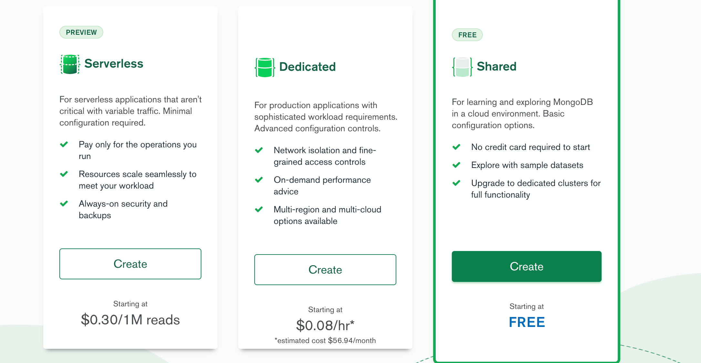
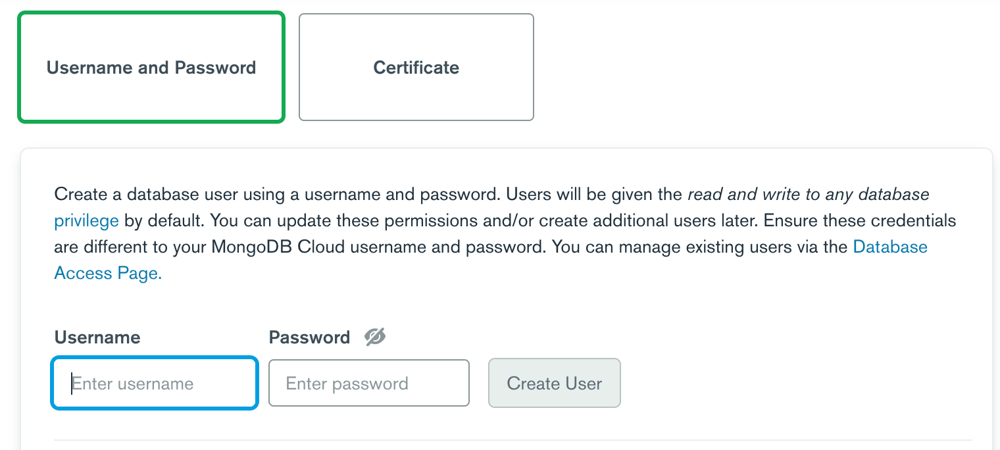
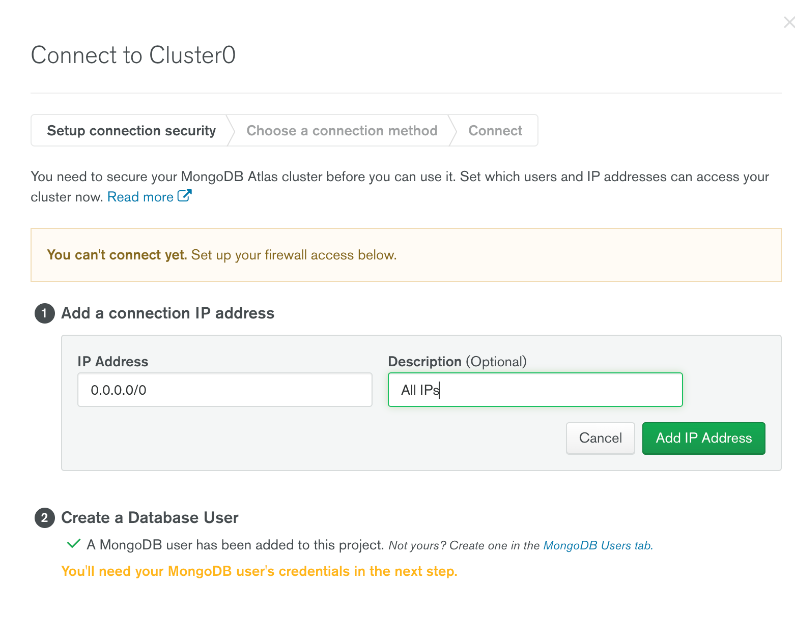
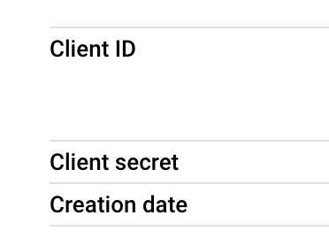
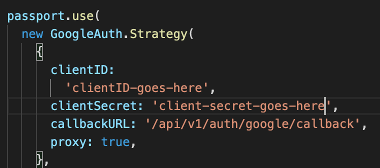
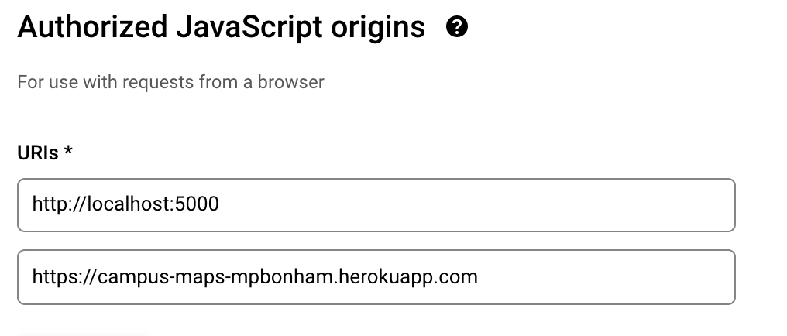

## Deployment Guide

### Prerequisites

- [Node](https://nodejs.org/en/)
- [Yarn @^1](https://classic.yarnpkg.com/en/docs/install#windows-stable)
- [Heroku account](https://www.heroku.com/)
- [Google Cloud account](https://cloud.google.com/)
- [MongoDB account](https://www.mongodb.com/)

### Step 1: Set up MongoDB

- Create Atlas cluster

- Create username and password

- Add IP 0.0.0.0/0 to allow access from all IPs

- Wait for cluster to be created
- Press connect button
  - Connect using MongoDB's native drivers
  - Driver should be Node.js with version 4.0 or later
  - Copy connection string to a seperate file (Deployment.txt) (we will need it later)

### Step 2: Clone repository

- Fork repository
- Clone fork
- Install server dependencies
  - `yarn`
- Install client dependencies
  - `cd client`
  - `yarn`

### Step 3: Create Google Auth credentials

- Create new Google Cloud project

- Go to APIs & Services > Credentials 
- Press create credentials button > OAuth client ID

- Select Web Application as application type
- Name the client ID whatever you would like
  - Copy the clientID and clientSecret from your credentials, values should be located here:
  
  - Go to `src/config/passport.ts` and replace clientID's string with your own as well as clientSecret's string with your own
  
  - Commit and push diffs
    - `git add src/config/passport.ts`
    - `git commit -m "(any commit message you'd like)"`
    - `git push`
  - We will set up the rest in step 5

### Step 4: Deploy to Heroku
- Go to account settings and connect GitHub account to Heroku account

- Authorize Heroku from GitHub
- Create new Heroku app
- Connect to fork (under your personal account)
- Go to app's settings tab
  - Reveal config vars
  - Create new config var
  - Key is `MONGODB_URI`
  - Value is the connection string from step 1
  - Remeber to enter your username and password into the specified fields of the connection string
  
  - Also remeber that the string should not include the <> characters.
  - Ex: mongod+srv:username:password@cluster0..
- Choose GitHub for deployment method
- Deploy `main` branch

### Step 5: Set up Google Auth authorization
- Go back to Google Cloud Platform and click on the credential you created
- Authorized JavaScript origins should have `http://localhost:5000` as well as your heroku URL (https)

- Authorized redirect URIs should have `http://localhost:5000/api/v1/auth/google/callback` as well as your heroku URL (https) with `/api/v1/auth/google/callback` appended to the end

### Development on localhost

When developing locally, MongoDB needs to be connected to work on localhost. The simplest way is to go to `src/index.ts` and replace the `mongodb://127.0.0.1:27017/Primary` string with the connection string from step 1. Since the string is supposed to be kept secret, ensure you don't commit the change.

### Extra information
If needed, contact Max Bonham on slack to get deployment help